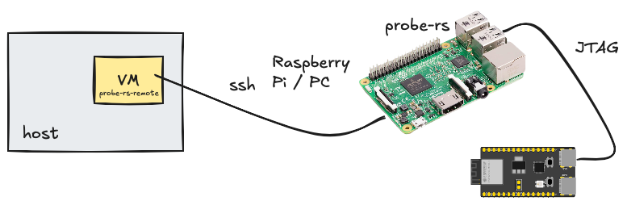

# `probe-rs` remote

..and `espflash`



This repo provides scripts to be run on a Mac/Linux developer account that make [`probe-rs`](https://github.com/probe-rs/probe-rs) and [`espflash`](https://github.com/esp-rs/espflash) running *on another computer* feel like a local tool.

This allows:

- **galvanic separation** of the attached electronics from the main development computer
- developing open source code so that people can choose, whether they prefer local or remote `probe-rs`/`espflash`, without *any changes* to the build files

**Supported commands**

- `probe-rs`
   - `help`, `list`, `info`, `erase`, `reset`, `run`
- `espflash`
   - `help`, `board-info`, `erase-*`, `hold-in-reset`, `monitor`, `reset`, `checksum-md5`, `flash`, `partition-table`, `write-bin`

## Requirements

- A Raspberry Pi 3B

	- ..with a stable IP address

	Use `ifconfig` to see the IP address. Below, we use `192.168.1.199` (replace with yours!).


## Steps

### `ssh` connection to the remote machine

Following [`[1]`](https://medium.com/@prateek.malhotra004/streamlining-secure-remote-access-a-guide-to-passwordless-ssh-connections-between-linux-servers-8c26bb008af9):

>**Creating a dedicated user (optional)**
>
>You might want to create a separate account on the relay machine, just for running `probe-rs`. This way, the ssh key pair won't allow access to full resources, just running `probe-rs`.
>
>```
>$ sudo adduser probe-rs
>```
>
>Give some pw and press `ENTER` for the defaults.

<p />
>Note: Consider another user name if you find it confusing to use also `espflash` under the `probe-rs` user. `#legacy`

On the development machine, create a key pair for using `ssh` without passwords:

```
$ ssh-keygen -t rsa
```

<!-- tbd.!!!
>Note: If you work on a VM (virtual machine), the above is fine. If you do this on your main account, you might want to name the key pair just for `probe-rs` use:
>
>```
>**tbd.**
>```
-->

Pass the public key to the `probe-rs` relay:

```
$ ssh-copy-id probe-rs@192.168.1.199		# use your own user and IP!!!
/usr/bin/ssh-copy-id: INFO: Source of key(s) to be installed: "/home/ubuntu/.ssh/id_rsa.pub"
/usr/bin/ssh-copy-id: INFO: attempting to log in with the new key(s), to filter out any that are already installed
/usr/bin/ssh-copy-id: INFO: 1 key(s) remain to be installed -- if you are prompted now it is to install the new keys
probe-rs@192.168.1.199's password: 

Number of key(s) added: 1
[...]
```

Test:

```
$ ssh probe-rs@192.168.1.199 whoami
probe-rs
```

Great!!!

### Set the `PROBE_RS_REMOTE` env.var.

The script (that we head towards..) uses this to see, where the remote account is expected to be.

```
$ echo "export PROBE_RS_REMOTE=probe-rs@192.168.1.199" >> ~/.bashrc 
$ source ~/.bashrc
```

```
$ echo $PROBE_RS_REMOTE
probe-rs@192.168.1.199
```

>Note! If you use some other shell than Bash, please adjust the commands accordingly. 

The `PROBE_RS_REMOTE` is now available, even if you were to restart.


### Install `probe-rs` on the remote machine

The official commands for [installing `probe-rs`](https://probe.rs/docs/getting-started/installation/) do not support Raspberry Pi 3B<sup>`|1|`</sup>, but it can be [cross-compiled](https://probe.rs/docs/library/crosscompiling/) for the device.

Follow instructions in [`docs/cross.md`](docs/cross.md) to:

- cross-compile `probe-rs` executable suitable for the Raspberry Pi
- transfer it to the device
- make some system-wide additions (`udev` rules)
- the same for `espflash`, too

<small>
>`|1|`:
>Not supporting Raspberry Pi 3B is not due to oversight, but the fact that its 1GB of RAM is not sufficient for the Rust build system. You can, of course, run Rust-based binaries on any machine.
</small>

Then, let's test it remotely:

```
$ ssh -q $PROBE_RS_REMOTE -t 'bash -ic "probe-rs --version"'
probe-rs 0.25.0 (git commit: 5805879)
```

We now have the remote machine all set up for running `probe-rs` via `ssh`.

### Setting up development side

The script to use on your *development machine* is at [`sh/probe-rs-remote.sh`](sh/probe-rs-remote.sh). 

Consider, whether you want to:

- a) just copy it to your favourite location (e.g. `~/bin/`), alongside the `PATH`, renaming to `probe-rs` in the process, or..

- b) ..have a symbolic link pointing to a clone of this repo. This makes updates easier.

**Create a '~/bin' folder on the PATH**

```
$ install -d ~/bin
$ echo PATH="\$PATH:$HOME/bin" >> ~/.bashrc
$ source ~/.bashrc
```

**a) copy; independent**

```
$ cp sh/probe-rs-remote.sh ~/bin/probe-rs
```

**b) link; points to the repo**

```
$ cd ~/bin
$ ln -s {path-to-repo}/sh/probe-rs-remote.sh probe-rs
```

> [!WARN]
> An `alias` would work for your interactive prompt, but not for build files which launch `bash` in a non-interactive mode.

Test:

```
$ probe-rs list
```

### Removing previous `probe-rs`

You can have both a local and the remote `probe-rs` simultaneously, but most of the time this is not needed, and is just a distraction. 

```
$ ls ~/.cargo/bin/probe-rs
```

If you have a file there, just remove it:

```
$ rm ~/.cargo/bin/probe-rs
```

## Using the command

Please attach a device to the remote machine.

```
$ probe-rs info
[...]
```

The script only supports a limited number of commands. Have a look at its contents for more info.

Now you have remote `probe-rs` working, transparently to your build systems. Yay! 🎉🎉

## What about `espflash`?

The process is very similar, but why would you want to have two separate flashing tools, in the first place?

- Many ESP32 projects online use it; it'll be easier to run those.
- `espflash` can use either of the USB ports (UART or JTAG) of your devkit; `probe-rs` uses USB/JTAG only
- The approaches are different: since `probe-rs` goes deeper into the MCU, its use sometimes causes incompatibilities that use of `espflash` avoids.

### Cross-compile

Follow the same [`docs/cross.md`](docs/cross.md) instructions.

### Testing

On the development machine:

```
$ espflash board-info
```

>**Naming note!**
>
>We currently use the `probe-rs` remote user name, and `PROBE_RS_REMOTE` env.var. also for `espflash`. The reason is only historic - did the ssh bridging to `ssh`, first.
>
>You may suggest better suiting names!!


## References

- `[1]`: ["Streamlining Secure Remote Access: A Guide to Passwordless SSH Connections Between Linux Servers"](https://medium.com/@prateek.malhotra004/streamlining-secure-remote-access-a-guide-to-passwordless-ssh-connections-between-linux-servers-8c26bb008af9) (blog; Sep'23)

